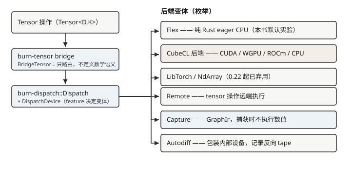
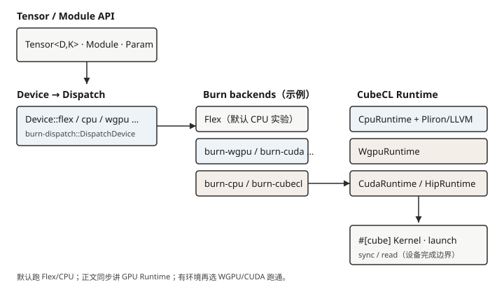

# Burn 技术栈

后面各章打开源码时，会反复碰到同一组 crate。本节只建立职责地图：谁负责
用户 API，谁负责分派，谁负责 Kernel。版本号与检出方式见
[如何运行本书示例](../running-examples.md)；改某一层时先看
[一次调用会经过哪些层](../crate-map.md)。

## 用户侧：Tensor、Module 与 Device

用户张量的核心形式是 `Tensor<D, K>`：

- `D` 是张量秩；
- `K` 表示浮点、整数或布尔等张量类别；
- 后端不再作为 `Tensor` 的类型参数出现。

后端选择被移动到 `Device`。用户先启用 Cargo feature，再用
`Device::flex()`、`Device::cuda(...)`、`Device::wgpu(...)` 等工厂方法
创建设备。模型代码可以使用统一的 `Tensor` 类型，由设备在运行时携带
具体后端身份。

`Module` 与 `Param` 组织模型结构和可训练参数。它们与 Tensor、Device
共同构成模型开发者最常接触的接口，第 2 章进入其类型和生命周期。

> 一些随附的 Burn Book 页面仍使用旧的 `Tensor<B, D>` 写法。概念仍可
> 参考，代码签名以 `burn-tensor/src/tensor/api/base.rs` 为准。

## 分派与后端契约

`Device` 内部包装 `burn-dispatch::DispatchDevice`。后者是带 feature
条件的枚举，可以包含 Flex、CUDA、ROCm、WGPU、LibTorch、Remote 或
Autodiff 等变体。一次张量操作会通过 bridge 和 dispatch 层到达相应后端。



`burn-backend` 定义 `Backend`、`BackendTypes` 和各类操作契约。具体后端
只要满足这些契约，就能被上层以统一张量语义使用。统一接口不意味着能力
完全相同：数据类型、图捕获、融合和量化支持都可能因后端而异。

默认实验使用 **Flex**：纯 Rust CPU 后端，便于在没有 GPU 驱动的环境中
运行。这些实验不会自动经过 CubeCL、CubeK 或 GPU 融合路径。

## 全书设备与 Runtime 地图

把「默认跑哪条」和「正文会讲哪条」分开看：



| 层次 | 入口（相对上游仓库） | 默认实验 | 正文位置 |
|---|---|---|---|
| Device / dispatch | `burn-tensor` 的 `Device`；`burn-dispatch` 的 `DispatchDevice` | `Device::flex()` | 第 1–2 章 |
| CPU 后端 | `burn-flex` | 是 | 语义观察 |
| GPU/图形后端 | `burn-wgpu`、`burn-cuda` 等 crate | 否（可选） | 第 3–4、7 章 |
| CubeCL 桥 | `burn-cubecl`、`burn-cubecl-fusion` | 第 3–4 章相关示例 | Kernel / Fusion |
| CubeCL Runtime | `CpuRuntime`、`WgpuRuntime`、`CudaRuntime`、`HipRuntime` | CPU；可选 WGPU | 同一 IR、不同设备完成边界 |

无独显时仍应把 GPU 拓扑与 Runtime 差异读完；有环境时再按
[如何运行本书示例](../running-examples.md) 做可选跑通。源码里存在
`CudaRuntime` 说明入口可定位，不等于默认示例已在该 GPU 上测过吞吐。

## 可组合能力：Autodiff 与 Fusion

Burn 将部分能力设计为后端或设备的装饰层：

- `burn-autodiff` 为后端增加反向自动微分；
- `burn-fusion` 记录操作流并利用 `burn-ir` 进行融合；
- CubeCL 后端还能通过 `burn-cubecl-fusion` 使用面向 Cube 的融合策略。

在 0.22 用户 API 中，梯度跟踪表现为 Device 的能力。启用 `autodiff`
feature 后，可通过 `.autodiff()` 包装设备。设备相等性主要比较硬件身份，
是否启用自动微分则需要 `is_autodiff()` 单独检查。

融合并不适用于所有后端。Flex、NdArray 和 LibTorch 可以与自动微分组合，
但不会因此自动获得 CubeCL 的融合执行路径。第 4 章会讨论 IR 与融合何时
真正减少内存访问和 Kernel 启动。

## CubeCL：Kernel 语言、编译器与运行时

CubeCL 是 Burn 加速后端的重要基础。它允许用 Rust 风格的 `#[cube]`
程序描述并行 Kernel，再转换到 CubeCL IR，经过优化后生成 CUDA、HIP、
SPIR-V、WGSL 或 CPU/MLIR 等目标所需代码。

它负责的不只是“把 Rust 翻译成 GPU 代码”，还包括：

- 设备和客户端运行时；
- 工作组、向量化和张量视图等并行抽象；
- Kernel 编译、缓存和提交；
- 自动调优所需的候选与测量基础。

第 3 章从硬件和编程模型理解 CubeCL，第 4 章再跟踪其 IR 与运行时。

## CubeK：可复用的高性能算子

CubeK 建立在 CubeCL 之上，提供矩阵乘、卷积、归约、注意力、随机数等
高性能算法。它更接近 Burn 加速后端内部使用的算子库，而不是通常由模型
作者直接调用的高层 API。

```text
Burn Tensor / NN
       │
       ▼
burn-cubecl 后端
       │
       ├── 通用 CubeCL Kernel
       └── CubeK 高性能算子
                    │
                    ▼
             CubeCL runtime → 设备
```

把 CubeCL 与 CubeK 分开很重要：前者提供语言、IR 和运行时，后者提供建立
在这些机制上的算法实现与调优策略。

## 训练、状态与模型交换

Burn 仓库还包含：

- `burn-train`：Learner、指标、渲染和训练组织；
- `burn-optim`：优化器；
- `burn-store` 与 Module Record：权重持久化和格式互操作；
- `burn-remote`：远程设备执行，本版中仍标记为 Beta；
- `burn-rl`：强化学习相关组件。

burn-onnx 是独立仓库。它先把 ONNX protobuf 转换为自己的 IR，再生成
Burn Rust 源码与权重。独立仓库意味着它有自己的 Burn revision；当前
`burn-onnx/Cargo.toml` 所 pin 的 Burn commit 与本教材示例的 commit
不同。第 7 章必须显式处理这种兼容关系，而不能只比较版本字符串。

## 阅读时记住的几件事

- Remote 仍标为 Beta；
- 量化支持因后端而异，当前路径没有 QAT；
- burn-onnx 只覆盖其列表中的算子，且依赖另一份 Burn 提交；
- 集合通信的契约在 backend，Flex 没有实现；
- 同一 Tensor API 不代表所有设备性能相同。

从 feature、trait 和支持矩阵判断「这一层保证了什么」，比记住版本号更有用。
打开对应 crate 的入口见[一次调用会经过哪些层](../crate-map.md)。

