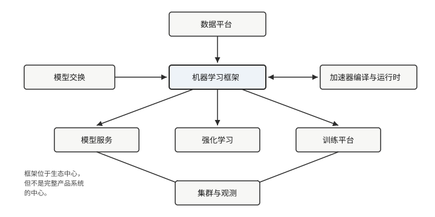

# 生命周期、生态与阅读路径

## 从数据到训练

一次训练任务通常经历以下路径：

```text
原始数据
  → 解析、变换、打乱、批处理
  → 前向计算
  → 损失
  → 自动微分
  → 优化器更新参数
  → 指标、日志与检查点
```

这条路径上的每一步都可能限制整体吞吐。数据准备太慢会让设备空闲；保存
检查点太频繁会造成 I/O 抖动；梯度同步不均衡会让快速进程等待慢速进程。
因此“模型能收敛”只是训练系统正确性的一个维度。

Burn 可以用自定义循环或 `burn-train` 组织训练。无论采用哪种接口，
Device、数据管道、模型状态和错误恢复都需要被显式设计。第 5、6 章分别
研究数据与训练系统。

## 从训练产物到推理

部署阶段不需要为参数计算梯度，却引入了新的系统问题：

- 如何恢复权重并确认模型结构匹配；
- 如何选择目标设备和数据类型；
- 如何控制批处理、并发和内存；
- 如何导入其他框架训练的模型；
- 如何验证转换前后的数值与语义；
- 如何监控延迟、吞吐和错误。

Rust 代码可以编译到服务器、桌面、WebAssembly 和部分 `no_std` 环境，
但目标可编译不代表所有模型和后端都适合该平台。部署能力最终由依赖、
算子、内存和设备共同决定。

## 机器学习系统生态

机器学习框架通常位于生态中心，却不是完整产品系统的中心：



联邦学习、推荐系统、可解释 AI、机器人和科学计算也属于更广泛的机器学习
系统生态。OpenMLSys v1 对其中多个主题有独立章节；为了先完成一条可验证的
Rust/Burn 技术路径，本书首版不逐一展开它们。

## 关于大模型时代的主题

本书的结构源自 OpenMLSys v1，其写作时间早于大语言模型（large language
model, LLM）系统的爆发。因此本书**没有**专门展开 LLM 推理与训练的
专题，包括 KV cache 与分页注意力（paged attention）、连续批处理
（continuous batching）、投机采样（speculative decoding）、混合专家
（mixture of experts, MoE）路由、预训练数据流水线和基于人类反馈的
强化学习（RLHF）。

但这并不意味着本书内容与这些主题无关：KV cache 的容量规划是第 3 章
算术强度与内存层级、第 7 章 batching 与队列的直接应用；MoE 路由是第
9 章拓扑放置与负载均衡的近亲；RLHF 采样—训练分离正是第 8 章
Actor–Learner 架构的生产形态。其中连续批处理与 KV 容量约束两个机制
已经有可运行的队列模型实验（第 7 章推理服务一节，
`ch07-serving-queue-sim`）；完整的 LLM 专章计划在后续版本加入，而
不是在本版中给出未经验证的转述。工程实现可从附录
[参考文献](../references.md#第-7-章-模型服务)中的 Orca 与
PagedAttention 论文进入。

## 三条阅读路径

### 模型开发者

先读第 1、2、5、6、7 章，建立 Tensor、Module、数据、训练与部署路径；
第 3、4 章可在需要自定义 Kernel 或性能分析时深入。

### 系统与框架开发者

按第 1–7 章顺序阅读，再进入第 8、9 章。重点关注 Backend 契约、IR、
运行时、设备能力和训练基础设施的边界。第 9 章会先复用第 6 章的
训练状态与集合通信，再引入集群控制面。

### Kernel 与编译器开发者

读完第 1、2 章后进入第 3、4 章，并直接配合固定的 CubeCL/CubeK 源码。
之后可根据场景选择训练、部署或集群章节。

第 8 章强化学习同时依赖模型执行和环境交互，适合在掌握训练循环后阅读。

## 如何对照本书使用的源码

本书不会用“当前最新版”代替可复现版本。各章末的「源码入口」和
[如何运行本书示例](../running-examples.md) 指向同一组固定依赖。普通
示例只需要按仓库根目录运行 Cargo 命令；只有想打开正文引用的上游文件时，
才需要按 `pins.toml` 中的 revision 检出对应仓库。读源码时建议：

1. 先按章节末入口定位公开类型、trait 和 feature；
2. 用本章示例或最小实验核对行为；
3. 再参考在线文档理解设计意图；
4. 若在线文档与本书示例冲突，以本书固定版本和示例为准。

预发布项目尤其如此：版本号相同不保证两个仓库用同一提交，文档示例也
可能落后于正在迁移的 API。

## 实验约定

- 基础实验默认使用 Flex CPU，不要求专有驱动；
- 正文代码通过 mdBook include 引用 `examples/`，避免两份源码漂移；
- GPU、浏览器、分布式和嵌入式实验会单独列出环境要求；
- 每个结论至少由测试、源码或可观察输出之一支持；
- 性能结果必须记录硬件、后端、dtype、形状和测量方法。

