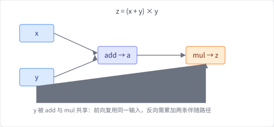
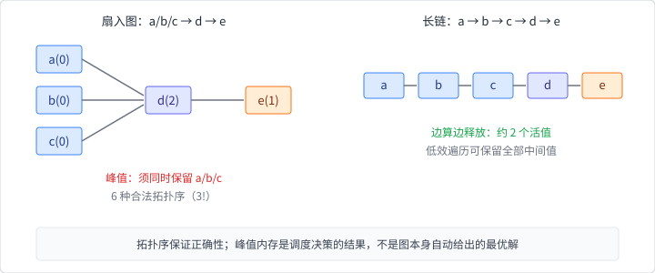
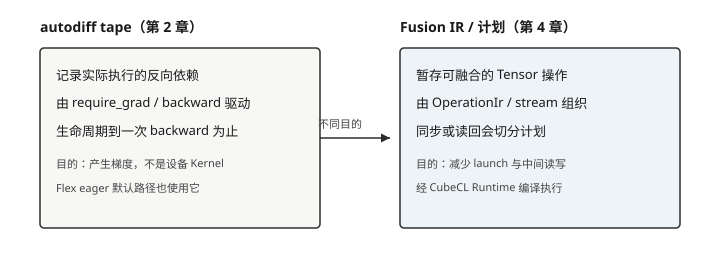

# 计算图的构成与生成

计算图（computational graph）用节点和边表示程序中的运算与依赖。对表达式

$$
z = (x + y) \times y
$$

可以画成：



算子是节点，Tensor 结果可视为携带数据依赖的边。图让系统能够讨论求导、
生命周期、并行和优化，而不必反复解释原始用户代码。

## 数据依赖与拓扑序

`mul` 必须等待 `add` 产生 `a`，但彼此没有依赖的节点可以并行。对无环图，
拓扑排序能产生满足依赖的执行顺序；不同合法顺序可能暴露不同并行度和内存
峰值。

看一个略大的例子（边上的数字是入度），并与长链对照峰值内存：



一种合法顺序是 `a, b, c, d, e`；另一种是 `b, a, c, d, e`。`a/b/c` 互不
依赖，可并行；`d` 必须等三者完成。这张图共有 $3! = 6$ 种合法拓扑序
（前三个任意排列，`d`、`e` 位置固定）。对这个特定图，任何顺序都绕不开
同时保留 `a/b/c` 三个值；但把图改成一条长链 $a \to b \to c \to d \to e$
就不同了——“边算边释放”的顺序任意时刻只保留约两个活值，而“先把所有
中间值算出来”的低效遍历可能同时保留全部中间值。拓扑序保证正确性，
不自动给出最低内存或最高并行度；峰值内存是调度决策的结果。

依赖不仅来自显式数据输入。随机数状态、原地修改、I/O 和通信都可能形成
隐藏副作用。为了安全重排操作，系统必须知道这些副作用，或限制可被优化的
程序范围。

## 控制流：图外路径与需编码的路径

Rust 的 `if`、循环和函数调用可以决定前向时实际执行哪些张量操作。Eager
模式只记录本次运行经过的路径：

```text
if condition {
    y = branch_a(x)     // 只这一侧进入 autodiff tape
} else {
    y = branch_b(x)
}
```

一次 backward 只需要本次被执行分支的依赖。语言控制流留在宿主程序里、不
进入张量 IR 的做法，常称为**图外控制流**。它易写、易调试，但完整程序在
编译前不可见。

若系统要提前编译、跨设备下发或做全局内存规划，则可能需要把控制流编码进
IR、展开循环，或对输入做 tracing。那时分支与循环次数成为表示的一部分，
优化窗口更大，表达与调试成本也更高。

**循环关系**与**循环依赖**不同。把循环体按迭代次数展开，并给每次迭代的
张量与算子新的标识，得到的是无环的展开图；若两个节点互相等待对方的输出，
则形成循环依赖，训练无法正常结束。固定 Burn 快照的主路径是 eager +
autodiff tape：宿主循环展开为多次算子调用，每次调用产生新的 tape 节点。

本章实验包含一个两分支只走一侧的梯度例子，用来固定“tape 只记录实际路径”
这一边界。

## 静态图与动态图

**静态图**通常在执行前获得较完整的程序表示，便于全局分析、部署和内存
规划，但动态控制流和调试可能更复杂。

**动态图**随用户程序执行即时运行算子，并按需要记录依赖。它与语言控制流
自然结合，错误位置更接近用户代码，但每次执行可能承担分派和记录成本。

二者不是非黑即白。一个系统可以 eager 执行用户程序，同时对局部算子流做
融合、对设备 launch 做 capture，或缓存某些 shape 的编译结果。

## 三种表示，不是一张“Burn 计算图”

在本版中至少要区分（与第 1、4 章地图同一套名字）：

```text
autodiff tape          反向依赖与中间值     ← 本章
Burn IR / Fusion 计划  子图搜索与执行块     ← 第 4 章
device graph capture   设备命令重放         ← 第 4 章（按 Runtime）
```



| 表示 | 目的 | 本书位置 |
|---|---|---|
| autodiff tape | 保存反向传播依赖和必要中间值 | 本章 |
| Burn IR / Fusion 计划 | 记录并优化算子流、生成融合 Kernel | 第 4 章 |
| device graph capture | 捕获设备 launch 以便重放 | 第 4 章 |

它们可能描述相似操作，却拥有不同节点、生命周期和正确性约束。将三者统称为
“Burn 计算图”会掩盖真实实现。统一用语见[术语表](../glossary.md)。

静动态图也要放进同一张地图读：Flex eager + tape 偏动态；Fusion 对局部
算子流做延迟与改写；部署侧的静态 artifact（第 7 章）冻结的是拓扑与权重，
不是把 autodiff tape 整包导出。调度直觉（谁先执行、何时 sync）见下一节
与第 4 章。

## 生命周期与内存

一个中间 Tensor 的最后一个消费者完成后，其存储可能被释放或复用；如果
反向传播需要它，则必须保存或之后重算。clone、分支和原地更新都会影响
引用关系。

梯度检查点（gradient checkpointing）通过少保存激活、反向时重算前向来
交换计算与内存。它不同于把训练参数保存到磁盘的 checkpoint。二者会在
自动微分与训练章节分别出现。
