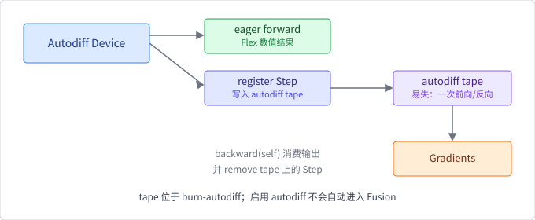

# 自动微分

自动微分（automatic differentiation，AD）把由基本算子组成的程序与这些
算子的导数规则结合，计算精确到机器浮点误差的梯度。

## 与其他求导方式的区别

- **手工求导**容易出错，也无法适应频繁变化的模型；
- **数值微分**用有限差分近似，成本高且受步长与舍入误差影响；
- **符号微分**生成新的代数表达式，可能产生表达式膨胀；
- **自动微分**沿实际程序应用链式法则，复用中间结果。

AD 不是符号代数系统，也不是有限差分。它对每个基本操作实现局部导数，再
按依赖图组合。

## 前向模式与反向模式的成本

设函数有 $n$ 个输入、$m$ 个输出。前向模式随着原计算传播输入方向的导数：
每追踪一个输入方向，大约要多付一倍前向计算量，求全部梯度约需 $n$ 次
这样的传播，适合输入较少、输出较多的情况。反向模式从输出向输入传播
伴随值（adjoint）：对一个输出求全部输入的梯度只需一次前向加一次反向，
而反向的计算量有经典结论——不超过前向的常数倍（对每个基本算子，反向
至多做一次乘加级别的局部工作，总体通常约为前向的 $2$–$3$ 倍），适合
输出较少的场景。

神经网络常有数百万参数而损失只有一个，即 $n\gg m=1$：前向模式要付出
约 $n$ 倍前向成本，反向模式只付出常数倍。这就是训练几乎总是使用反向
模式（反向传播，backpropagation）的原因。它的代价不在计算而在内存：
反向需要前向的中间值，必须保存或重算，下文会定量讨论。

Burn 固定快照实现一阶反向模式自动微分，不支持通过嵌套 autodiff 直接
求高阶导。

## 一个带数字的反向传播推演

令 $x=2$、$w=3$，定义：

$$
a = x\,w,\qquad z = a + x,\qquad \ell = z^{2}.
$$

**前向**逐节点求值并记录依赖：$a = 6$，$z = 8$，$\ell = 64$。

**反向**从 $\partial\ell/\partial\ell = 1$ 开始，按依赖反序应用链式
法则，每个算子只做局部求导：

1. $\ell = z^2$：$\partial\ell/\partial z = 2z = 16$；
2. $z = a + x$：$\partial\ell/\partial a = 16 \times 1 = 16$，
   同时给 $x$ 贡献一条路径 $16 \times 1 = 16$；
3. $a = xw$：$x$ 再获得一条路径 $16 \times w = 48$，
   $w$ 获得 $\partial\ell/\partial w = 16 \times x = 32$。

$x$ 被两个算子消费，因此它的总梯度是**两条路径之和**：
$16 + 48 = 64$。可以用解析导数验证：
$\ell = x^2(w+1)^2$，$\partial\ell/\partial x = 2x(w+1)^2 = 64$，
$\partial\ell/\partial w = 2z\,x = 32$，完全一致。

这个小例子已经包含反向模式的全部要点：每个算子只需知道自己输入输出
的局部导数；系统按依赖顺序组合它们；被多次消费的中间值要**累加**来自
不同后继的伴随值——这也是为什么反向遍历必须按拓扑序（或等价的深度
序）进行，保证一个节点的全部后继都处理完之后再使用它的梯度。

## Burn 的动态 tape

启用 `autodiff` feature 后：

1. `Device::flex().autodiff()` 用 Autodiff 包装底层 Flex Device；
2. 在该 Device 上创建的浮点 Tensor 可调用 `require_grad()` 标记叶子；
3. 前向算子立即在 Flex 上计算，同时把需要求导的节点登记到动态 tape；
4. `output.backward()` 从输出反向执行已登记步骤，返回 Gradients；
5. `leaf.grad(&gradients)` 取得对应叶子的梯度 Tensor。



tape 位于 `burn-autodiff`，不是 `burn-ir`。Flex 前向也不会因为启用
autodiff 自动进入 Fusion。

## tape 的生命周期

固定源码可以回答“tape 里的步骤何时存在、何时消失”：

- 前向时，每个需要梯度的算子向 tape 登记一个反向步（`Step`）。`Step`
  契约（`burn-autodiff/src/graph/base.rs`）要求它携带父节点列表和深度，
  并且 `step()` **消费自身**；
- `backward(self)` 同样消费输出 Tensor（`tensor.rs`），服务端从 tape 中
  逐个**移除**并执行这些步骤（`runtime/server.rs` 中的
  `steps.remove`），执行后清理不再可用的节点；
- 因此被消费过的路径不能再次反向。需要第二轮梯度（例如两次优化器
  更新）时，要重新前向、重建 tape。

换言之，tape 是“一次前向、一次反向”的易失结构，不是可以反复查询的
静态图。这与上一节计算图的讨论一致：记录依赖是为了这一次反向，而不是
为了长期分析程序。

## 反向模式的内存代价

反向需要前向的中间值。以一个宽度 1024、batch 64、`f32` 的 24 层 MLP
为例，仅每层线性变换的**输出**激活就是
$64 \times 1024 \times 4\ \text{B} = 256\ \text{KiB}$，24 层合计约
$6\ \text{MiB}$；而矩阵乘的反向同时需要两个输入，实际每层的保存量
还要计入输入激活，总激活内存很容易达到参数本身的数倍。层数或 batch
翻倍，这部分线性增长。

固定源码中与此对应的机制有两处：

- `runtime/memory_management.rs` 用引用计数（`NodeRefCount`）跟踪每个
  节点的状态，最后一个消费者完成后即可释放或复用其存储——反向并不
  要求无限期保存所有中间值；
- `checkpoint/` 模块提供梯度检查点（gradient checkpointing）支持：
  少保存激活、反向时重算前向，用额外计算换内存。注意它不同于第 6 章
  把训练状态写入磁盘的 checkpoint。

## 叶子、非叶子与 `require_grad`

用户通常在输入或参数等**叶子 Tensor** 上调用 `require_grad()`。中间结果
如果依赖需要梯度的父节点，会自动参与反向传播；把非叶子强行转换成新的
require-grad 叶子不符合当前 API 约束。

`is_require_grad()` 说明该 Tensor 是否要求保留梯度。没有任何输入要求
梯度时，系统可以避免构建不必要的反向链。

## `detach` 与 `inner`

- `tensor.detach()` 切断旧图并形成新叶子；固定快照会保留原来的
  require-grad 意图；
- autodiff Tensor 的 `inner()` 去除自动微分元数据，返回底层数值 Tensor；
- `device.inner()` 去除 Device 的 autodiff 包装。

三个操作不能仅凭名字类推。尤其是 `detach()` 不等于把 Tensor 移回 CPU，
也不等于清除其数值。

## 梯度与参数更新

`backward()` 返回的 Gradients 是一次反向传播的结果容器。读取梯度不会
自动更新 Module 参数；优化器需要消费梯度、更新参数并管理自己的状态。

因此应把以下概念分开：

```text
autodiff tape ──backward──► Gradients
                                 │
优化器状态 + Module 参数 ◄───────┘
```

本章实验只验证梯度数值。参数更新、梯度清理、混合精度和训练循环留到
第 6 章。

## 固定源码导读

想亲自核对本节描述，建议按以下顺序阅读固定 revision 的
`burn/crates/burn-autodiff/src/`：

1. `graph/base.rs`：`Step` trait——反向步的契约（消费自身、父节点、
   深度）；
2. `graph/traversal.rs`：反向遍历如何从根节点按依赖推进，保证后继
   先于前驱处理；
3. `graph/node.rs` 与 `graph/requirement.rs`：节点标识与梯度需求标记；
4. `runtime/server.rs`：`backward` 如何取出步骤、执行并清理；
5. `runtime/graph.rs`：多图合并（`GraphLocator`）与每图互斥的客户端
   注释——为什么这对多设备训练重要；
6. `runtime/memory_management.rs`：引用计数如何决定中间值何时可释放；
7. `grads.rs`：Gradients 容器的注册与读取；
8. `checkpoint/`：梯度检查点的挂接点。
