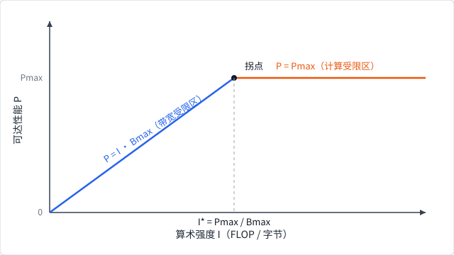

# GEMM 与优化阶梯

通用矩阵乘（general matrix multiplication, GEMM）通常写为：

$$
C=\alpha AB+\beta C,
$$

其中 $A\in\mathbb{R}^{M\times K}$、$B\in\mathbb{R}^{K\times N}$、
$C\in\mathbb{R}^{M\times N}$。忽略边界情况时，计算量约为 $2MNK$ 次
浮点运算。GEMM 同时具备规则并行、数据复用和清晰的正确性参考，因此适合
贯穿硬件与软件层。

## 0. 先用 Roofline 判断优化方向

GEMM 的计算量约为 $2MNK$。若把输入加载的元素数作为一个简化的字节
代理，可以定义算术强度（arithmetic intensity）：

$$
I=\frac{2MNK}{\text{加载的输入元素数}}.
$$

真实 Roofline 模型使用字节数，并且还要计入输出写回、缓存命中、布局、
对齐和同步；这里的元素版本只用于解释方向。给定设备的计算峰值
$P\_{\max}$ 和内存带宽 $B\_{\max}$，理想上限可写为：

$$
P\_{\text{attainable}}\leq
\min(P\_{\max},\ I\cdot B\_{\max}).
$$

当 $I\cdot B\_{\max}<P\_{\max}$ 时，增加数据复用、改善布局或减少读写通常
比增加乘加指令更有希望；当计算上限更低时，向量化、矩阵指令和并行占用
才是主要方向。这个判断不证明某个实现一定更快，因为 launch、边界、
cache 和同步都没有包含在式子里。

本章的 `tile_load_counts` 把朴素路径和 tiled 路径的输入加载次数及这个
简化强度输出出来。对 `16×16×16`、`8×8×8` tile，加载次数从 8192 降到
1024，强度从 1 提高到 8；这只验证复用模型，不验证真实带宽或硬件
吞吐。

## 1. 一个 unit 计算一个输出

最直接的映射让一个 unit 负责 $C\_{ij}$，沿 $K$ 维做点积：

$$
C\_{ij}=\sum\_{k=0}^{K-1}A\_{ik}B\_{kj}。
$$

它容易验证，却会让相邻输出反复从全局内存读取相同的 A 行或 B 列。若布局
使相邻 unit 的地址跨距很大，还会浪费内存事务。

朴素实现仍非常重要：它是小 shape 的低启动成本候选，也是复杂 Kernel 的
reference。优化器不应删除最后一条可靠回退路径。

## 2. Tiling 与共享内存

把输出划成 tile 后，一个 cube 可以协作：

1. 从 A、B 各加载一块到共享内存；
2. cube 级同步，确保 tile 可见；
3. 每个 unit 用共享 tile 更新私有累加器；
4. 遍历 K 方向的下一组 tile；
5. 最终把累加器写回 C。

一次全局加载可服务多个乘加，因此提高了相对于全局内存的算术强度。tile
太小则复用不足，太大则增加共享内存、寄存器和边界处理，甚至降低可同时
驻留的 cube 数量。

本章实验的加载计数模型可以逐步推导。朴素路径中每个输出 $C\_{ij}$ 独立
读取完整的一行 A 和一列 B：

$$
L\_{\text{naive}} = M \cdot N \cdot (K + K) = 2MNK.
$$

tiled 路径中，每个输出 tile 沿 K 方向走 $K/T\_K$ 步，每步加载一块
$T\_M \times T\_K$ 的 A 和一块 $T\_K \times T\_N$ 的 B，而输出 tile
共 $(M/T\_M)(N/T\_N)$ 个：

$$
L\_{\text{tiled}} =
\frac{M}{T\_M}\frac{N}{T\_N}\frac{K}{T\_K}
\left(T\_M T\_K + T\_K T\_N\right).
$$

代入 $M=N=K=16$、$T\_M=T\_N=T\_K=8$：朴素 $2 \times 16^3 = 8192$ 次，
tiled $2 \times 2 \times 2 \times (64+64) = 1024$ 次——与
`tile_load_counts` 的计数一致。强度从
$2MNK/L\_{\text{naive}} = 1$ 提高到 $8$：直觉上，A 的每个元素在一
个输出 tile 内被复用 $T\_N$ 次，B 的每个元素被复用 $T\_M$ 次，
tile 越大复用越多。

## 3. Thread tile 与向量化

进一步让一个 unit 计算多个相邻输出，可复用寄存器中的 A/B 值。连续加载
也可以使用 `Vector<F, N>`。这对应 OpenMLSys CUDA 实验中的 thread tile
和 `float4` 思想，但 CubeCL 不承诺特定向量宽度在所有 Runtime 上等价。

若一个 unit 读取 $m$ 个 A 元素与 $n$ 个 B 元素并完成 $mn$ 个乘加，忽略
输出写回时，它相对于输入元素的计算/加载比可粗略写成：

$$
\frac{2mn}{m+n}。
$$

增大 $m,n$ 可提高复用，也会占用更多寄存器。这个公式提供方向，不替代
设备测量。

## 4. 双缓冲与流水线

单缓冲流程在“加载下一 tile”和“计算当前 tile”之间串行等待。双缓冲准备
两组存储，让当前 tile 计算时预取下一 tile，再交换角色。更高级的异步拷贝
和多阶段流水线沿用同一思想。

流水线正确性比性能更重要：

- 第一次计算前必须填充；
- 每次交换前必须满足生产者/消费者同步；
- 最后一次计算后不能读取未填充的下一缓冲；
- 边界 tile 的无效位置必须填零或被谓词屏蔽。

这些控制会增加代码与特化数量。只有当加载延迟确实可被计算覆盖时，复杂
流水线才可能收益。

## 5. 矩阵指令和布局

CMMA/MMA 类指令一次处理固定 shape 的 fragment，并要求特定 dtype 与布局。
高性能 GEMM 因而需要在全局 tile、共享 stage、unit/plane tile 与矩阵
fragment 之间转换。CubeK 的 component、routine 和 blueprint 正是为组合
这些层次而设计。

## 6. 本章实验停在哪一步

本章有两类实验，职责不同：

| 实验 | 验证什么 | 不验证什么 |
|---|---|---|
| `scale_kernel`（`ch03-cubecl-kernel`） | `#[cube]`、拓扑、raw BufferArg、unchecked launch、CPU/可选 WGPU 正确性 | tiling、共享内存、GEMM 性能 |
| `tile_load_counts`（`ch03-tile-loads`） | 朴素与 tiled 全局加载次数的数量级差异 | 真实 cube 共享内存、同步或带宽 |

也就是说：优化阶梯 1–5 节是概念地图；可执行最小步目前是“用加载计数理解
tiling 为何减少全局读”，而不是在 CubeCL 里重写完整共享内存 GEMM。真正的
共享内存 Kernel 与 CubeK 策略对照留给练习和后续扩展。

## 7. 评价一个实现

至少记录：

- 矩阵 shape、batch、布局和 dtype；
- Runtime、设备型号和软件快照；
- warm-up、同步点、重复次数与统计量；
- 是否包含编译和 autotune 的首次成本；
- 数值容差及 reference；
- 与哪些候选策略比较。

OpenMLSys 原实验展示了 RTX 3080 上逐步优化并与 cuBLAS 比较的结果。这些
数字不能迁移为 CubeCL/CubeK 或其他设备上的结论。本书保留优化阶梯，不
复述“手写 Kernel 普遍快于库”之类的设备特定胜负。

