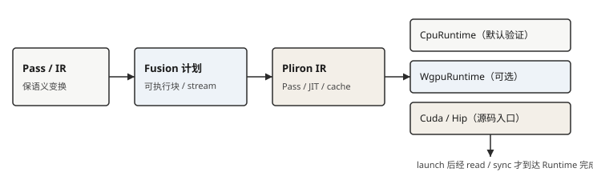

# 编译栈与中间表示

## 1. 为什么不能直接从 API 跳到机器码

用户写下 `((a + b) * c).exp()` 时，系统还不知道：

- shape、dtype、layout 和 Device 的具体组合；
- 中间结果是否会被其他操作读取；
- 哪些操作可以融合；
- 目标 Runtime 支持哪些 Kernel；
- 内存何时可释放或原地复用；
- 编译与调优结果能否命中缓存。

如果每层都直接理解用户 API，系统会重复实现分析逻辑。中间表示
（intermediate representation, IR）把程序语义转换成更适合某一阶段处理的
数据结构，Pass 则读取和变换该结构。

## 2. IR 的三个常见形态

### 线性 IR

指令按顺序排列，常配合临时值、基本块、SSA（static single assignment）
和控制流图。它适合局部数据流、支配关系与代码生成分析。

### 图 IR

节点表示操作或值，边表示数据/控制依赖。它适合 Tensor 级子图匹配、融合、
调度和跨算子优化。

### 混合表示

现实系统常在图节点内部使用线性程序，或在 SSA 上建立图分析。选择不是
“图还是线性”的一次性答案，而取决于当前优化粒度。

机器学习 IR 通常还要表达动态 shape、dtype、layout、设备、广播、别名、
副作用和可求导性。信息越丰富，优化机会越多；表示和合法性检查也越复杂。

## 3. 多层 IR 是必要分工

本书技术栈至少包含以下不同表示：

| 层次 | 主要内容 | 主要目的 |
|---|---|---|
| Rust/Tensor API | Module、控制流、Tensor 操作 | 用户表达 |
| autodiff tape | 前向依赖与反向步骤 | 一阶反模式求导 |
| Burn OperationIr / Fusion | Tensor 操作、shape、dtype、资源状态 | 子图搜索与执行计划 |
| GraphIr / Capture | 有显式输入输出边界的操作序列 | 图捕获与重放，不执行数值 |
| CubeCL Pliron IR | dialect 上的 op、region、SSA 值 | Kernel 优化与 dialect conversion |
| KernelDefinition | `Scope` body、info、settings | 可编译 / launch 的接口 |
| 后端产物 | LLVM、SPIR-V、CPP/设备源码、WGSL | 目标 Runtime 执行 |

它们不是同一张“计算图”的不同打印格式。一次操作可以进入 autodiff tape
而不进入 Fusion；Flex 可以 eager 执行而不生成 Fusion OperationIr；
`burn-capture` 产出的 `GraphIr` 服务于捕获与重放，不等于求导或融合图。

### 3.1 CubeCL 把自定义 IR 换成了 Pliron

CubeCL 过去自维护一套 Kernel IR 和基于控制流图的优化器。本版把它换成
[Pliron](https://github.com/pliron-org/pliron)：一套用 Rust 写成、受 MLIR
启发的可扩展编译 IR 框架。动机不是换一个打印格式，而是让 Kernel 编译器
拥有与产业编译栈同类的基础设施：

- **方言（dialect）**：同类操作放在同一命名空间，而不是一个巨大的指令枚举。
  CubeCL 的方言包括 `math`、`memory`、`scf`、`vector`、`plane`、`matrix`、
  `ssa_matrix`、`barrier`、`atomic`、`tma`、`branch`、`bitwise` 等，源码在
  `cubecl-ir/src/dialect/`；
- **Pass 与 rewrite**：分析、CSE、mem2reg、SROA、DCE 走同一套
  `pliron::pass` / `irbuild` 接口，而不是每个后端各写一份 petgraph 遍历；
- **方言转换**：结构化控制流（`scf`）可以降到 LLVM 控制流或 CPP/WGSL
  能表达的形式；硬件不支持的路径在 conversion 时报错或走 polyfill。

`#[cube]` 展开后的 `Scope` 仍然存在：它是 **host 侧建造器**，内部持有
Pliron 的 `Context` 与 `ModuleOp`。`KernelDefinition` 仍然存在：它把
`Scope` body、参数 metadata（`Info`）和 `KernelSettings` 收成 Compiler
的输入。读者看到的“CubeCL IR”因此有两层：建造期的 Scope，以及 Scope 里
已经登记好的 Pliron 操作。

这是下一代编译基础设施的地基，不是“Fusion 和 autodiff 也迁到了 Pliron”。
张量级融合仍在 `burn-ir` / `burn-fusion`；反向仍在 `burn-autodiff` tape。

## 4. 编译器与运行时的交界

可把流水线抽象为：

前五步偏编译器，后三步偏运行时，但边界会移动。JIT 在运行时拿到真实
shape 和设备后编译；autotune 通过真实执行反过来影响选择；缓存同时属于
编译产物管理和运行时策略。

把图再按职责拆成两段读：

- **前端**：OperationIr 注册、Pass、与 autodiff tape 的边界——回答“哪些
  Tensor 操作可以合法变换/融合”。
- **后端**：Kernel 选择、内存与 stream、CubeCL 的 Pliron Pass / JIT /
  cache、launch 与 read/sync——回答“计划如何落到某个 Runtime
  （CPU/WGPU/CUDA/HIP/Metal）”。

同一套 Fusion 计划可以接到不同设备 Runtime；CubeCL 侧则是同一套 Pliron
方言，由各 Compiler 做目标相关 lowering。变的是完成边界与资源模型，
不是用户 Tensor 表达式本身。CPU Fusion 实验用来观察计划切分；有
WGPU/CUDA 时用同一计划核对 launch/read，不要把 CPU flush 习惯抄到 GPU。

## 5. AOT、JIT 与 Eager

- **Eager**：操作到达后尽快执行，调试直接，但跨操作优化窗口小；
- **AOT**（ahead-of-time）：部署前编译已知程序，启动快但要求足够静态；
- **JIT**（just-in-time）：运行时按真实输入/设备特化，灵活但有首次成本；
- **延迟执行**：先注册操作，遇到策略决定或物化边界再执行。

这些模式可以组合。Burn Flex 是 eager 路径；Burn Fusion 延迟 Tensor
操作并搜索执行块；CubeCL 对实际 Kernel 变体执行 JIT。CubeCL
支持编译缓存（`cubecl-environment` 还提供可随二进制分发的预热 bundle），
但没有可概括为“完整统一 AOT 产品”的一等 API。
