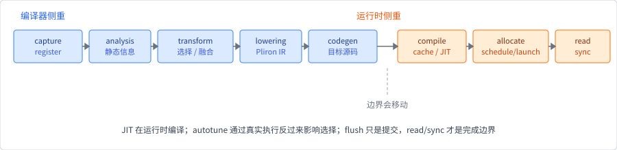

# 编译栈与中间表示

## 1. 为什么不能直接从 API 跳到机器码

用户写下 `((a + b) * c).exp()` 时，系统还不知道：

- shape、dtype、layout 和 Device 的具体组合；
- 中间结果是否会被其他操作读取；
- 哪些操作可以融合；
- 目标 Runtime 支持哪些 Kernel；
- 内存何时可释放或原地复用；
- 编译与调优结果能否命中缓存。

如果每层都直接理解用户 API，系统会重复实现分析逻辑。中间表示
（intermediate representation, IR）把程序语义转换成更适合某一阶段处理的
数据结构，Pass 则读取和变换该结构。

## 2. IR 的三个常见形态

### 线性 IR

指令按顺序排列，常配合临时值、基本块、SSA（static single assignment）
和控制流图。它适合局部数据流、支配关系与代码生成分析。

### 图 IR

节点表示操作或值，边表示数据/控制依赖。它适合 Tensor 级子图匹配、融合、
调度和跨算子优化。

### 混合表示

现实系统常在图节点内部使用线性程序，或在 SSA 上建立图分析。选择不是
“图还是线性”的一次性答案，而取决于当前优化粒度。

机器学习 IR 通常还要表达动态 shape、dtype、layout、设备、广播、别名、
副作用和可求导性。信息越丰富，优化机会越多；表示和合法性检查也越复杂。

## 3. 多层 IR 是必要分工

本书固定技术栈至少包含以下不同表示：

| 层次 | 主要内容 | 主要目的 |
|---|---|---|
| Rust/Tensor API | Module、控制流、Tensor 操作 | 用户表达 |
| autodiff tape | 前向依赖与反向步骤 | 一阶反模式求导 |
| Burn OperationIr/Fusion | Tensor 操作、shape、dtype、资源状态 | 子图搜索与执行计划 |
| CubeCL Scope/KernelDefinition | unit 级指令、IO、CubeDim | Kernel 优化与 lowering |
| 后端产物 | MLIR/LLVM、SPIR-V、CPP/设备源码等 | 目标 Runtime 执行 |

它们不是同一张“计算图”的不同打印格式。一次操作可以进入 autodiff tape
而不进入 Fusion；Flex 可以 eager 执行而不生成 Fusion OperationIr；设备
graph capture 又服务于命令重放，不等于求导或融合图。

## 4. 编译器与运行时的交界

可把流水线抽象为：

前五步偏编译器，后三步偏运行时，但边界会移动。JIT 在运行时拿到真实
shape 和设备后编译；autotune 通过真实执行反过来影响选择；缓存同时属于
编译产物管理和运行时策略。

## 5. AOT、JIT 与 Eager

- **Eager**：操作到达后尽快执行，调试直接，但跨操作优化窗口小；
- **AOT**（ahead-of-time）：部署前编译已知程序，启动快但要求足够静态；
- **JIT**（just-in-time）：运行时按真实输入/设备特化，灵活但有首次成本；
- **延迟执行**：先注册操作，遇到策略决定或物化边界再执行。

这些模式可以组合。Burn Flex 是 eager 路径；Burn Fusion 延迟 Tensor
操作并搜索执行块；CubeCL 对实际 Kernel 变体执行 JIT。固定 CubeCL 快照
支持编译缓存，但没有可概括为“完整统一 AOT 产品”的一等 API。

