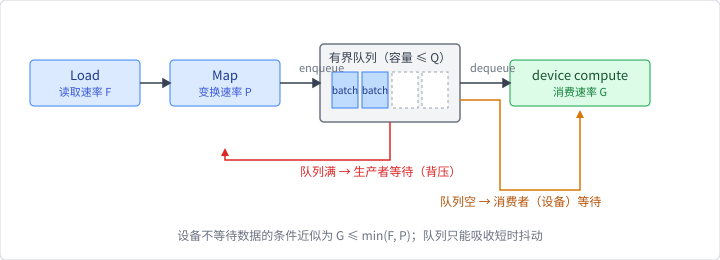

# 数据路径、语义与成本模型

## 从样本到设备

数据系统首先解决的是边界问题，而不是某个具体文件格式。对一个训练
epoch，可以把路径抽象成：

```text
Load → Shuffle / Select → Map → Batch → Send
```

- **Load** 从内存、文件或远端存储取得一个样本；
- **Shuffle / Select** 决定本轮访问哪些样本、以什么顺序访问；
- **Map** 解码、清洗、归一化或特征变换；
- **Batch** 把多个样本组成一次模型输入；
- **Send** 把 batch 交给目标设备。

这些阶段不一定各自对应一个线程或一个类型。它们是用来分析职责的
语义分界。比如一个 SQLite Dataset 可以在 `get` 时同时完成 Load 和
反序列化，而 Burn 的 Batcher 负责把已经读取的 Rust item 变成 batch。

## 吞吐率与队列

设存储读取速率为 $F$，CPU 变换速率为 $P$，设备消费速率为 $G$。理想
情况下，设备不会等待数据的条件近似为：

$$
G \leq \min(F, P).
$$

当 $F < G$ 时，系统是 I/O bound；当 $P < G$ 时，系统是 CPU bound。
Load、Map 和模型计算可以用有界队列重叠执行，但队列只能隐藏短时抖动，
不能改变长期瓶颈。增大 worker 数也可能增加反序列化、线程通信、内存
占用和上下文切换开销。

若生产者和消费者之间的队列容量为 $Q$，一个最小的背压模型是：



当队列达到 $Q$，生产者必须等待；当队列为空，消费者必须等待。增大 $Q$
可以吸收读取时间的短期抖动，却会增加排队内存和失败时的重做范围。它也
不能修复 $F$ 或 $P$ 的长期不足。

算一笔账：若设备消费速率 $G = 1000$ batch/s，存储读取只有
$F = 800$ batch/s，那么无论队列多大，长期缺口都是
$200$ batch/s——容量 $Q = 100$ 的队列只能把“设备开始空转”的时刻
推迟 $Q / (G - F) = 0.5$ 秒。反过来，若 $F \geq G$ 只是偶发抖动
（例如每 10 秒出现一次 0.2 秒的读取停顿，缺口累计
$1000 \times 0.2 = 200$ batch），$Q = 256$ 就足够完全吸收。
队列容量该由“要吸收多长的抖动”决定，而不是拍脑袋设大。这个模型正是
为什么“多 worker”与“预取”不能只按线程数量评价：还要同时观察队列
深度、设备空闲时间和峰值内存。

还要区分两种并行：

- **流水线级并行**：Load、Map、Batch、Send 和设备消费由不同阶段重叠，
  目标是让阶段同时工作；
- **算子级并行**：同一阶段内部并行执行 decode、map 或 Tensor 算子，目标
  是缩短该阶段的服务时间。

`MultiThreadDataLoader` 主要改善本地读取/批处理的流水线供给，不自动把
任意 map 编译成 GPU Kernel，也不等于算子图融合。只有明确把变换写成
Tensor 操作并把设备边界放在 Batcher 或模型输入处，才进入第 2–4 章的
Tensor/Kernel 路径。

因此一次测量至少要记录：

1. 样本数和 batch size；
2. worker 数和是否启用 shuffle；
3. 数据是否已经在内存中；
4. 是否包含首次初始化、编译和线程池创建；
5. 计时的开始/结束边界。

本章实验使用很小的内存数据集，目的是观察语义和调度，不是宣称某个
CPU 配置的普遍性能。真正的文件读取性能还需要固定数据格式、文件系统、
缓存状态和样本大小。

## 两种“顺序”

数据系统里至少有两种顺序：

- **语义顺序**：Shuffle 或 Selection 产生的样本序列；
- **到达顺序**：并发 worker 把已经处理的 batch 发送到消费者的顺序。

单线程时两者通常重合。多线程时，如果没有显式的序号和重排缓冲，到达
顺序会受到样本读取耗时、变换耗时和线程调度影响。数据不丢失并不等于
输出顺序保持不变。

这一区分很重要：训练常常只要求每轮覆盖正确的样本集合，而调试、回放、
测试快照或某些有状态预处理则可能要求稳定的顺序。系统设计必须先声明
需要哪一种保证，再选择并行策略。

## 与前几章的边界

第 2 章的 autodiff tape 记录 Tensor 前向依赖，第 4 章的 Burn Fusion
记录可延迟的 Tensor 操作；数据管道的 Dataset 变换不是这两种表示。数据
样本可能是字符串、图像字节或自定义 Rust struct，只有 Batcher 之后才
通常进入 Tensor 计算。
