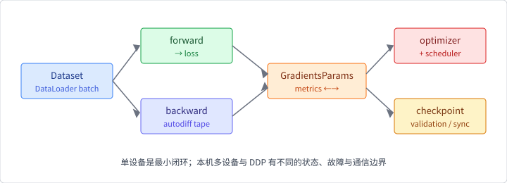

# 第 6 章 训练系统

第 5 章解决的是样本怎样到达模型。本章继续沿着这条边界向后走：一个 batch
到达设备后，训练系统怎样组织前向、反向、参数更新、验证、检查点和多设备
同步。训练系统不是把 `loss.backward()` 和 `optimizer.step()` 放进更大的
`for` 循环就结束了；它还要管理学习率、梯度累积、指标、状态恢复和不同
设备之间的等待关系。

## 本章问题

一个训练系统如何组织前向、反向、优化、检查点和跨设备通信，并在规模增长
时保持正确的状态与可接受的效率？哪些能力属于 本书所用的 Burn 版本，哪些仍然
需要后端、集群或额外协议？

## 学习目标

完成本章后，你应该能够：

1. 用 loss、gradient、optimizer state 和同步边界描述一次训练迭代；
2. 阅读 Burn 的 `TrainStep`、`Learner`、`ModuleOptimizer` 和
   `SupervisedTraining` 之间的职责分工；
3. 解释 Rust 中 module ownership 如何让“参数更新后得到新 module”成为
   显式的数据流；
4. 区分学习率调度器、梯度累积、检查点和数据 sampler 状态；
5. 区分 Burn `MultiDevice` 的本机多设备训练和 DDP 的梯度 collective；
6. 用延迟/带宽模型分析 AllReduce 为什么会成为同步训练的成本；
7. 通过 CPU 实验验证一次训练循环确实降低 loss 并改变参数；
8. 分清本版已跑通的单设备训练，与尚未覆盖的参数服务器、流水线并行、
   集群容错和 Flex CPU DDP。

## 先修知识

建议先完成第 2 章的 Tensor、Device、Module 和 autodiff，第 4 章的执行/
同步边界，以及第 5 章的 Dataset、DataLoader 和数据切分。需要理解 Rust
trait、所有权、线程和基本概率/梯度概念。不要求先拥有 CUDA、NCCL 或多机
集群。

## 本章路线

我们先从框架无关的训练状态和成本模型开始，再进入 Burn 的 API：

与第 9 章的分工见后文控制面/数据面对照图（[`ch06-ch09-control-data-planes.svg`](img/ch06-ch09-control-data-planes.svg)）：本章落在训练数据面。

单设备训练是最小闭环；本机多设备把数据和梯度放在同一进程内分摊；DDP
进一步要求后端 collective 和跨节点启动协议。不要把三者都简称为“并行”：
它们的状态、故障和通信边界不同。

相对第 5 章，本章多出的是**训练状态与梯度同步**。默认实验仍在 Flex CPU
上观察 loss 下降；正文会同步导读 `DistributedContext` / `all_reduce` 源码
入口，并说明 GPU 数据面期望什么。真 NCCL/多机跑通不是默认路径，见
[如何运行本书示例](running-examples.md) 中的可选跑通说明。

## 小节

1. [训练状态、迭代与成本模型](ch06/01-training-state-and-cost.md)
2. [前向、反向与自定义训练循环](ch06/02-forward-backward-loop.md)
3. [burn-train 的 Learner 与训练装配](ch06/03-burn-train-orchestration.md)
4. [优化器、学习率与检查点](ch06/04-optimizer-and-checkpoint.md)
5. [本机多设备与数据并行](ch06/05-local-data-parallel.md)
6. [集合通信、DDP 与能力边界](ch06/06-collective-and-ddp.md)
7. [实验：CPU 线性回归训练循环](ch06/07-training-loop-lab.md)
8. [练习、延伸阅读与来源](ch06/08-exercises-and-sources.md)

示例代码位于 `examples/ch06-training-loop`，正文只通过 mdBook include
引用其中的训练循环片段。它使用本版 Flex CPU，不下载数据，也不
把一次本地 loss 曲线当成跨设备性能结论。
