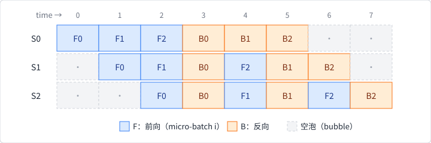

# 本机多设备与数据并行

## 数据并行的语义

数据并行复制同一个训练程序和模型结构，把一个训练集 batch 分到多个
设备。每个设备只看本地样本，得到本地梯度，再聚合为一次更新：

```text
          同一 model 副本
       ┌────────┼────────┐
    batch 0   batch 1   batch 2
       │        │        │
      g0       g1       g2
       └────────┼────────┘
              aggregate
                  │
             optimizer step
```

若局部 batch 样本数相等且 loss reduction 一致，梯度的 `Mean` 与单设备
大 batch 相近；不等 batch、最后一批和不同权重的样本则需要按样本数加权。
这个数学条件比“设备数能整除 batch size”更重要。

## `ExecutionStrategy::MultiDevice`

固定 `burn-train` 的 `ExecutionStrategy` 用
`MultiDevice(Vec<Device>, MultiDeviceOptim)` 表达本机多设备训练。它与
DDP 的区别首先在于：这里的策略把 device 列表和 loader 切分放在一个进程
内处理，不要求用户另行启动每个节点。

`multi/strategy.rs` 的流程是：

1. 用 `split_dataloader` 按设备得到多个训练 loader；
2. 把验证 loader 移到第一个主设备；
3. 将 learner model fork 到主设备；
4. 每个设备创建一个训练 worker；
5. 每轮从各 loader 取一个 batch 并并发执行 `TrainStep`；
6. 依据 `MultiDeviceOptim` 聚合梯度并更新。

训练 worker 会把 model fork 到自己的 device，再执行 forward/backward。返回
消息由 receiver 收集；不要把 worker 完成顺序当成样本顺序或事件顺序的
稳定保证。第 5 章已经说明了多 worker 到达顺序的同类边界。

## 两种本机优化策略

### `OptimMainDevice`

`multi/epoch.rs` 将每个 worker 的梯度移到主设备，进入一个
`GradientsAccumulator`，然后调用普通的 `optimizer_step`。优点是状态
集中、解释直接；代价是主设备承担梯度聚合和 optimizer 更新的内存/计算。

### `OptimSharded`

每个设备保留自己的 `GradientsParams` 和设备信息，最后调用
`optimizer_step_multi`。`ModuleOptimizer::step_multi` 在参数 mapper 中
选择一个梯度来源，并把其他来源迁到同一设备后累积。固定源码中的
`MultiGradientsParams::remove` 还按 parameter ID 在多个梯度容器中选择起点，
所以它不是“所有参数永久放在编号相同的设备”这一简单约定。

`OptimSharded` 仍然是同一进程、本机设备集合的训练策略；“sharded”在这里
描述梯度/optimizer 更新的分布方式，不自动等于模型并行或跨节点参数分片。

## 和模型、流水线并行的区别

- **数据并行**：程序/模型结构复制，数据分片；
- **模型并行**：参数或算子放到不同设备，激活在设备间传递；
- **流水线并行**：模型阶段分片，再用 micro-batch 重叠阶段执行；
- **混合并行**：组合上述协议，并定义张量重新布局和同步时机。

固定版本的 `ExecutionStrategy` 明确实现了单设备、本机 `MultiDevice` 和
DDP 路径；它没有因为存在 `MultiDevice` 就自动提供通用模型并行或
pipeline scheduler。`Learner::grad_sharded()` 是 DDP 相关的梯度同步标记，
不是任意模型切分 DSL。

## 流水线并行的 micro-batch 时间线

模型/流水线并行的难点不只是“把层放到不同设备”。若阶段为
$S\_0,S\_1,\ldots,S\_{p-1}$，把一个大 batch 拆成 $m$ 个 micro-batch 后，
理想的 1F1B 调度会近似经历：



具体 schedule 可能不同，但都会面对 warm-up/cool-down 的 pipeline bubble、
micro-batch 数量、激活保存和 backward 依赖。这个代价可以定量：设每个
micro-batch 在每个阶段的前向+反向耗时为 $t$，则理想 1F1B 的总时长约为
$(m + p - 1)\,t$，而其中有用的 micro-batch 工作只有 $m\,t$，空泡占比

$$
\frac{p-1}{m+p-1}.
$$

3 个阶段、3 个 micro-batch（上图）空泡占 $2/5 = 40\%$；把 $m$ 增到
16 则降到 $2/17 \approx 12\%$。增加 $m$ 可以摊薄 bubble，
却可能增加激活缓存（每个在途 micro-batch 的激活都要跨阶段保存）；
重计算可以降低内存，却增加算力。阶段之间还要定义
通信 tensor 的 layout、dtype、stream 和失败恢复点。

固定 Burn 的 `ExecutionStrategy` 没有在源码中提供上述 stage scheduler、
micro-batch 编排或 activation recomputation 协议。这个时间线是框架无关
的系统模型，不应从 `MultiDevice` 或 `grad_sharded()` 推导出 pipeline
并行已实现。

## 设备、loader 与 batch 的三个层次

容易混淆的三个操作是：

1. 第 5 章的 `DataLoader::to_device`：把 Batcher 输出交给目标 Device；
2. `split_dataloader`：为多个设备建立本地数据视图；
3. `Learner::fork`：把 model 参数迁移/复制到训练设备。

三者必须配对。一个 loader 在主设备生成的 Tensor，不会仅因为 worker 后续
在线程中运行，就自动变成另一个设备的 Tensor。Burn 的多设备策略显式为
每个 worker 固定目标设备，正是为了避免隐式跨设备传输。

## 本机并行的测试重点

在没有跨节点通信时，仍可测试：

- 每个设备拿到的样本 shard 是否覆盖且不重复；
- 局部 loss reduction 是否与全局 batch 目标一致；
- 梯度聚合后的参数更新是否与单设备 reference 接近；
- optimizer state 归属设备是否稳定；
- worker 错误能否终止训练而不是静默丢 batch。

这些测试比只比较 `num_devices = 1` 和 `num_devices = 2` 的墙钟时间更有
解释力。固定 CPU Flex 实验选择单设备路径，因为 Flex 没有可运行的
collective；本节的 `MultiDevice` API 来自固定源码对照，不是本实验的运行
结果。
