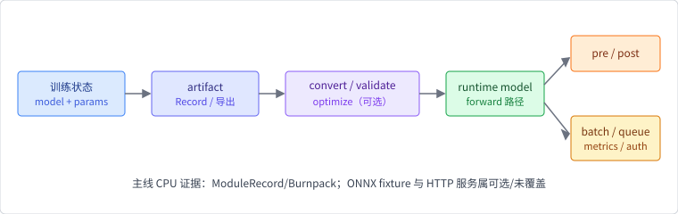

# 第 7 章 模型服务

训练结束不是系统结束。模型从训练进程走到用户请求，至少要经过状态导出、
格式或图转换、数值校验、运行时选择、输入输出契约，以及排队与限流。
模型服务（model serving）关心的不只是「能不能算出一个 tensor」，还要
回答：文件由谁解释、权重何时进入设备、请求怎样合并，延迟和显存由哪一层
负责。

这是 OpenMLSys「模型部署」一章的对应物。产业里对应 ONNX Runtime、
TensorRT、Triton Inference Server，以及大模型场景下的 vLLM / 连续批处理。
本章有两条线：**产物线**（Record / Burnpack / ONNX）和 **服务线**（batch、
队列、KV 预算）。默认实验走产物往返；连续批与 KV 用队列模型把机制跑出来。

## 本章问题

训练产物如何转换、校验并部署到服务器、浏览器或受限设备？请求到达之后，
系统如何在延迟、吞吐和显存之间取舍？生成式服务里 prefill / decode 和
KV cache 改变了哪些成本？

## 学习目标

完成本章后，你应该能够：

1. 把部署拆成产物（artifact）、执行运行时、请求服务和安全治理；
2. 解释 ONNX 图到可执行路径为什么不是文件改名；
3. 区分模型拓扑、参数状态、权重格式、backend 和服务协议；
4. 使用 `ModuleRecord` / Burnpack 保存并恢复参数，并读出容器布局；
5. 区分几种权重加载策略，以及它们与运行时 Device 正交；
6. 用 batch、队列、TTFT / TPOT 和 KV 预算建立服务成本模型；
7. 解释 Remote 与 WASM / `no_std` 各自停在哪；
8. 分清「参数能恢复」和「已经有一条生产服务」。

## 先修知识

建议先完成第 2 章的 Module 和第 6 章的训练状态。需要理解二进制产物和
基本的延迟/吞吐概念。

## 本章路线

`ModuleRecord` 验证「参数能否恢复到一个 module」；`burn-onnx` 把 ONNX
图生成 Burn Rust 源码。仓库里的 burn-onnx 仍指向另一份 Burn 提交，因此
ONNX 路径与 Record 实验分开讲。

服务侧的路由、鉴权、限流和灰度是应用系统的职责。生成式场景额外的
prefill / decode 与 KV 预算，用第 7 章队列实验观察机制。

## 小节

1. [部署边界、artifact 与服务成本](ch07/01-deployment-boundary.md)
2. [ONNX、图转换与 Burn Rust 代码生成](ch07/02-onnx-and-codegen.md)
3. [ModuleRecord、Burnpack 与权重格式](ch07/03-record-and-artifacts.md)
4. [压缩、精度与离线优化](ch07/04-compression-and-optimization.md)
5. [推理 runtime、批处理与服务接口](ch07/05-inference-runtime-and-service.md)
6. [Remote、WASM/no_std 与部署边界](ch07/06-remote-wasm-and-nostd.md)
7. [实验：CPU 模型状态往返保存与恢复](ch07/07-record-roundtrip-lab.md)
8. [练习、延伸阅读与来源](ch07/08-exercises-and-sources.md)

第 5–7 章覆盖「数据 → 训练 → 产物 → 推理」的最小闭环；书末
[综合实验](capstone.md) 会把这条链跑一遍。训练切分与服务队列的成本
数字合读见[训练与服务成本实验](capstone-infra.md)。

示例位于 `examples/ch07-record-roundtrip` 与 `ch07-serving-queue-sim`。
