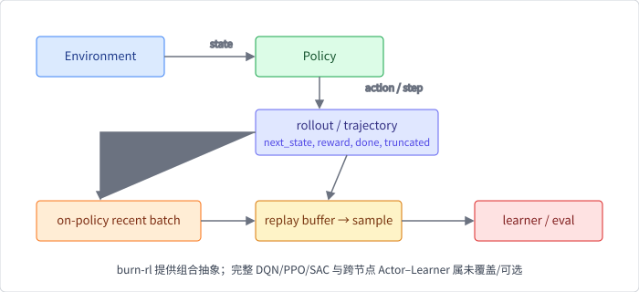

# 第 8 章 强化学习系统

强化学习（reinforcement learning，RL）不是把监督学习的 loss 换一个名字。
它的训练数据由策略和环境共同产生：智能体（agent）观察环境，选择动作，
环境返回下一个状态与奖励，采样器再把这些交互交给学习器。环境速度、策略
版本、回放容量、终止语义和设备传输，都会改变算法实际看到的数据。

## 本章问题

如何把环境交互、轨迹（trajectory）、经验回放（experience replay）、
策略更新和评估组织成一个可测试的系统？固定 Burn 快照中的 `burn-rl`
和 `burn-train` 分别提供哪些抽象，又没有提供哪些完整算法或分布式
多智能体能力？

## 学习目标

完成本章后，你应该能够：

1. 用 MDP 区分 state、observation、action、reward、`done` 和 `truncated`；
2. 解释环境 step、策略 inference、transition 和 episode 的所有权边界；
3. 区分 on-policy、off-policy、trajectory 与 replay batch；
4. 使用 Burn 的 `Environment` 和 `TransitionBuffer` 构造 CPU rollout；
5. 解释 `Policy`、`Batchable`、`ToObservation`/`ToAction` 和
   `PolicyLearner` 如何组合，而不是把它们误认为某个具体算法；
6. 用采样吞吐、inference batching、队列等待和设备拷贝建立成本模型；
7. 说明 `burn-train` 的多环境 off-policy 编排、评估和 checkpoint 边界；
8. 识别多智能体、Actor–Learner、league 和跨节点通信仍需额外系统协议的部分。

## 先修知识

建议先完成第 2 章的 Tensor、Device、Module 和 ModuleRecord，第 5 章的
数据管道，以及第 6 章的训练循环、checkpoint 和通信边界。需要理解 Rust
trait、关联类型、`Clone`/`Send`、随机采样和基本概率；不要求先安装
游戏模拟器、CUDA 或集群。

## 本章路线

先从框架无关的 MDP 和数据生命周期开始，再阅读 `burn-rl` 的环境、策略和
回放抽象，最后进入 `burn-train` 的多环境 off-policy 编排。实验刻意使用
一个确定性、无外部依赖的小环境：它能验证 transition 的形状、episode
边界、循环 buffer 和 TD 更新，却不会把 gym simulator、神经网络结构和
分布式通信混成一个无法定位问题的黑盒。

固定版本边界必须明确：`burn-rl` 没有内置 DQN、PPO 或 SAC；具体
`PolicyLearner` 由应用实现。`burn-train` 能编排环境、异步
inference、replay、训练、评估和 checkpoint，但这不等于已经提供通用
多智能体 league 或跨节点 Actor–Learner runtime。

## 小节

1. [MDP、环境与轨迹边界](ch08/01-mdp-environment-and-trajectory.md)
2. [Policy、观察转换与动作批处理](ch08/02-policy-and-batching.md)
3. [Transition、回放与采样](ch08/03-replay-and-sampling.md)
4. [Rollout 吞吐、异步环境与推理队列](ch08/04-rollout-throughput.md)
5. [TD 更新、off-policy 与训练编排](ch08/05-learning-and-off-policy.md)
6. [多智能体与分布式系统边界](ch08/06-multi-agent-boundary.md)
7. [实验：CPU 确定性 rollout 与 replay](ch08/07-rollout-lab.md)
8. [练习、延伸阅读与来源](ch08/08-exercises-and-sources.md)

若你想继续向规模化走，第 9 章会把多个训练/采样进程放回共享集群，
讨论队列、拓扑、故障与遥测。

示例代码位于 `examples/ch08-rl-rollout`，使用本书固定版本 Burn 的
Flex CPU。它分两个阶段验证环境交互与回放：`done`/`truncated` 边界、
`TransitionBuffer` 的容量与随机 batch shape、transition 产生处的在线
表格 TD 更新，以及 learner 真正从 replay batch 学习的回放驱动路径——
并用 `capacity = 1` 的极端对照展示容量如何截断 learner 的数据分布。
实验不下载 gym、不使用网络、不训练神经网络，也不把一次单进程测试外推为
GPU 仿真或多智能体吞吐结论。
