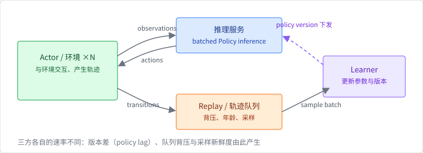

# 多智能体与分布式系统边界

## 从一个 agent 到多个 agent

单智能体 MDP 只有一个动作 $a\_t$ 和一个奖励 $r\_t$。多智能体系统至少
需要说明：

$$
(\mathcal{S},\mathcal{A}\_1\times\cdots\times\mathcal{A}\_N,
\mathcal{T},\mathbf{R},\gamma).
$$

这里的联合动作空间会随 agent 数量扩张；每个 agent 还可能只看到自己的
observation $o\_i$，获得自己的 reward $r\_i$，并通过通信或环境间接观察
其他 agent。系统需要明确游戏是合作、竞争还是混合，否则“最大化 reward”
甚至没有唯一含义。

奖励也有不同的 credit assignment 语义：

- **共享标量奖励**：所有 agent 看到同一个 $r$，合作简单，但难以判断
  哪个 agent 对结果负责；
- **奖励向量**：每个 agent 得到 $r\_i$，可以表达竞争或个体目标，但
  learner 需要定义联合目标或均衡；
- **集中训练、分散执行（CTDE）**：训练时 critic 可以看到联合状态/
  动作，执行时 actor 只能使用自己的 observation；这要求训练和部署的
  schema、网络 topology 和 checkpoint 分开描述。

因此把一个标量 `reward` 复制到 N 个环境 worker，并不会自动实现 MARL
的 credit assignment。

一个常见架构划分是：



Actor 负责与环境交互，learner 负责更新参数；它们之间需要定义 policy
version、trajectory schema、backpressure、checkpoint 和失败重试。多人
self-play 还需要 opponent sampling、模型评估、选择和防止策略循环的
机制。这个系统问题远大于把一个 `Policy` clone 几次。

## Burn 可以组合什么

`burn-train` 的 `MultiAgentEnvLoop` 能创建多个环境实例，并用
`AsyncPolicy` 做 batched inference。这适合：

- 同一 policy 在多个独立环境中并行采样；
- 将环境 step 和 policy inference 通过 channel 解耦；
- 用 `env_id` 将 transition 归还到对应 runner；
- 在 `OffPolicyStrategy` 中将多个环境的 transition 汇入一个 replay。

这里的“多环境”不等于“多智能体”。`burn-rl` 的
`Environment` 只有一个 `Action` 类型；`Policy` 也只定义一个 action
batch。下表把「搭一个 MARL / 分布式 RL 系统需要什么」与「`burn-rl` /
`burn-train` 已经给出什么」对齐；第三列就是应用要自己设计的部分：

| 系统需要 | 已提供 | 应用要补的设计 |
|---|---|---|
| 多环境并行采样 | `MultiAgentEnvLoop` + `AsyncPolicy` 合批 | 环境数、batch 上限与背压调优 |
| 各 agent 的观察/动作 | 单一 `Observation`/`Action` 类型 | 联合动作结构与各 agent 的转换 |
| credit assignment | 单一标量 reward 通道 | 共享标量 / 奖励向量 / CTDE 的选择 |
| 跨节点 actor 组网 | 进程内 channel 与 thread | transport、发现、鉴权与重试 |
| 策略版本与 league | policy record 保存/恢复 | version 协议、opponent sampling、评估 |

这些缺口模块可以复用 Burn 的 tensor/model，但要由应用自己实现。

## 非平稳性与版本

单智能体 off-policy replay 假设行为 policy 的变化可以由算法处理；多
智能体中其他 agent 也在变化，环境对任一 agent 看起来会变成非平稳。一个
replay item 至少可能需要：

```text
(agent_id, observation, action, reward,
 next_observation, done, policy_version, opponent_version)
```

如果只保存 tensor 而不保存 version，learner 无法判断旧数据来自哪个
联合策略。自博弈系统还会遇到 exploitability、循环策略和评估不对称；
这些是博弈/系统协议，不能用单纯增加 replay capacity 解决。

## 与分布式训练的关系

第 6 章的 DDP 解决的是“多个设备如何同步同一个训练模型的梯度”，而
Actor–Learner RL 解决的是“采样方与更新方如何交换有时延的数据”。两者
可以组合，却不是同一协议：

```text
DDP:             replica → gradient collective → replica
Actor–Learner:   actor → trajectory/replay → learner → policy version
```

Actor–Learner 需要考虑数据陈旧、采样公平、队列背压和 worker 退出；
DDP 需要 collective participant、同步和梯度归一化。Burn 的
`OffPolicyStrategy` 是单进程编排入口，不能替代集群调度、服务发现、
跨节点授权、elastic membership 或故障恢复。

动手搭分布式 RL 时，先把这六个条件写成可验证的设计决定：

1. actor 与 learner 的 transport 和序列化格式；
2. policy version 与 replay item 的一致性；
3. queue 上限、丢弃/重试和重复 transition 的处理；
4. checkpoint 的原子性以及 replay 是否包含在恢复点；
5. 环境、策略和评估 worker 的随机种子；
6. metrics 如何区分采样吞吐、learner 吞吐和端到端 reward。

Ape-X、IMPALA 和 Ray 对这六个问题都有公开的工程答案，出处见附录
[参考文献](../references.md#第-8-章-强化学习系统)。

## 本节小结

Burn 提供的是可组合的单进程环境、policy、batching 和 learner
接口，以及多个环境的 rollout 编排。多智能体联合决策、league/self-play、
Actor–Learner 跨节点协议和容错仍是应用系统与后续章节的工作；把多个
environment worker 称为 MARL 会掩盖这些真正的复杂度。
