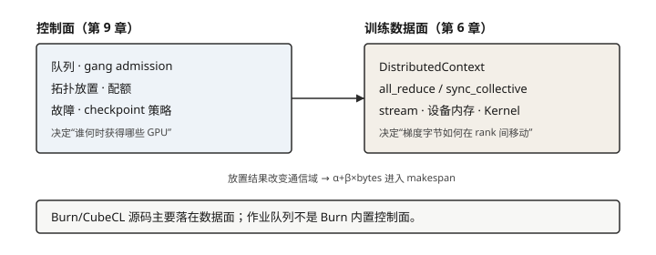

# 第 9 章 大规模 GPU 集群管理

## 本章问题

当训练跨越大量节点后，系统如何调度昂贵的加速器、处理故障并定位性能
瓶颈？

## 学习目标

完成本章后，你应该能够：

1. 区分集群控制面、训练通信数据面和 GPU 设备运行时；
2. 用 GPU、节点、机柜、ToR（Top of Rack）和 Spine 描述通信域；
3. 为一个成组调度（gang scheduling）作业写出 GPU、显存和网络域需求；
4. 用 `alpha + beta * bytes` 模型解释集合通信和拓扑放置的关系；
5. 解释 FIFO、拓扑感知放置、配额和资源碎片之间的取舍；
6. 设计带 checkpoint、attempt、step 和幂等确认的故障恢复协议；
7. 区分 Burn/CubeCL 已核验的本机/设备接口与外部集群调度职责；
8. 在 CPU 离散事件模拟器中观察队列等待、跨机柜流量、通信成本和重试。

## 先修知识

建议先完成第 4 章的 stream、内存和执行边界，第 6 章的训练状态、数据
并行、集合通信和 checkpoint，第 7 章的部署成本。需要理解 Rust 的
`struct`、`enum`、trait、集合类型和基本的离散事件模拟；不要求 CUDA、
NCCL、RDMA 或真实 GPU 集群。

## 本章路线

```text
workload card
    │ GPU / memory / bytes / failure domain
    ▼
control plane ── queue ── admission ── placement ── recovery
    │
    ▼
training data plane ── all-reduce / all-gather / checkpoint
    │
    ▼
device runtime ── stream / memory pool / kernel / sync
```

先定义集群作业的资源和完成条件，再从硬件拓扑推导通信成本。之后讨论
队列、成组调度、拓扑放置、多租户与故障协议，最后放入纯 Rust 模拟器。
相对第 6 章：那里讲清梯度同步**数据面**期望什么；本章把一次 AllReduce
的字节量放进机柜/链路，看控制面放置如何改变 $\alpha+\beta$ 成本。Burn
的 DDP / `DistributedContext` 与 CubeCL client 仍是数据面源码案例，不是
作业队列实现。默认实验用虚拟时间；真集群遥测不在默认路径。



## 小节

1. [集群负载、系统分层与能力边界](ch09/01-cluster-workload-and-boundary.md)
2. [GPU 节点、机柜与网络拓扑](ch09/02-gpu-node-and-network-topology.md)
3. [作业队列、资源向量与成组调度](ch09/03-job-queue-and-resource-scheduling.md)
4. [拓扑感知放置与集合通信成本](ch09/04-topology-aware-placement-and-communication.md)
5. [多租户、配额与资源碎片](ch09/05-multitenancy-and-fragmentation.md)
6. [故障、检查点与可观测性](ch09/06-faults-checkpoints-and-observability.md)
7. [实验：CPU 集群调度与故障模拟器](ch09/07-cpu-cluster-simulator-lab.md)
8. [练习、延伸阅读与来源](ch09/08-exercises-and-sources.md)

示例代码位于 `examples/ch09-cluster-simulator`，只使用 Rust 标准库和虚拟
时间。它验证调度协议、通信成本模型、checkpoint 恢复和资源归还；它不
测量真实 GPU、网络或 NCCL 性能，也不声称 本书所用的 Burn 版本提供作业队列、
多租户隔离、弹性 membership 或自动故障迁移。
