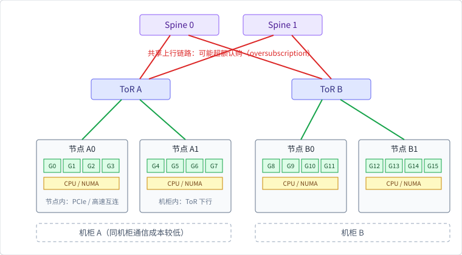

# GPU 节点、机柜与网络拓扑

## 通信不是一条均匀的总线

OpenMLSys v1 用一个多层树描述机器学习集群：服务器内有多个加速器，
多个服务器放在机柜（rack）中，机柜连接架顶交换机（ToR），多个 ToR
再通过 Spine 交换机连接。这个结构至少产生三种通信域：

1. **设备内**：GPU 显存、shared memory、stream 和 kernel；
2. **节点内**：GPU 与 CPU 通过 PCIe 等总线连接，设备之间可能有更快的
   专用互连；
3. **节点间**：数据经过 NIC、ToR、Spine 和其他机柜，受链路共享影响。

节点内也不是均匀的：CPU socket、PCIe root complex、GPU 高速互连和
NUMA 位置都会影响数据搬运。跨机柜则要进一步考虑上行链路是否被多个
ToR 共享。

## 为什么节点内值得单独一档：数量级直觉

三类通信域的带宽差不是百分之几十，而是数量级。OpenMLSys v1 引用其
写作年代的产品代际给出过一组数字（仅用于建立量级直觉，不代表当前
产品规格，也不构成本书验证的性能结论）：

| 链路 | 量级（统一换算到字节） |
|---|---|
| GPU 显存（HBM） | $10^3$ GB/s |
| 节点内加速器互连（如 NVLink） | $10^2$ GB/s |
| 节点内 PCIe 总线（全设备共享） | $10^1$ GB/s |
| 机柜间以太网 | $10^0$–$10^1$ GB/s（10–25 Gb/s） |
| 机柜间 InfiniBand | $10^1$–$10^2$ GB/s（100–200 Gb/s） |

比较前注意单位：网络带宽惯用 Gb/s（比特），内存带宽惯用 GB/s
（字节）。统一换算后可以看到，每往外跨一档链路，可用带宽通常低
1–2 个数量级；同一节点内，专用互连又比共享 PCIe 总线高约一个
数量级。所以放置器的优先顺序不是一句“尽量同机柜”，而是：
**同节点 → 同机柜跨节点 → 跨机柜**，每一档都对应可观察的成本跳变。
原作给出的 ToR–Spine 超额认购比值（约 1:4 到 1:16）也解释了为什么
瓶颈集中在树的根部——越靠近 Spine，链路越稀疏。



## 超额认购与热点

设多个服务器同时把梯度发往另一机柜。如果每台服务器的下行链路都能
独立发送，而 ToR 到 Spine 只有一条较窄的上行链路，那么峰值需求就会
超过物理链路容量。这叫网络超额认购（oversubscription）。它的结果不是
单个 GPU kernel 变慢，而是 collective 的排队和传输时间变长。

可以用一个简单的域模型表示链路：

```text
GPU ── node ── rack/ToR ── Spine ── rack/ToR ── node ── GPU
       fast          shared / oversubscribed          fast
```

热点可能来自两种原因：

- **拓扑热点**：大量作业同时跨过同一条 ToR–Spine 上行链路；
- **数据热点**：某一组参数或 embedding 被远多于其他参数的请求访问。

因此“总带宽足够”不代表某个作业能得到足够带宽。调度器需要把通信域
作为资源和放置约束，而不是只比较 GPU 数量。

## 把拓扑变成成本函数

为每条链路记录容量、延迟和当前占用，作业放置后可以估计：

$$
C\_{\text{comm}} =
\sum\_{e\in\text{path}}
\left(\alpha\_e + \beta\_e \cdot bytes\_e\right)
\cdot penalty\_e.
$$

这里 `alpha` 是启动/传播延迟，`beta` 是单位字节传输成本，
`penalty` 表示共享链路或超额认购造成的额外代价。教学模拟器不实现
真实网络排队，而是把每个 GPU pair 按三个通信域分类——同节点、
同机柜跨节点、跨机柜——分别乘以确定性 multiplier。这足以比较放置
策略的协议趋势，不足以作为 GPU 集群 benchmark。

一个拓扑感知的放置器通常按以下顺序尝试：

1. 找到满足显存需求的空闲 GPU；
2. 先在同一节点内凑齐成组资源；
3. 凑不齐时退到同一机柜（跨节点）；
4. 仍无法满足再选择跨机柜组合，并估计新增的跨域通信；
5. 将选择结果和通信域写入作业记录，便于之后解释慢 step。

“成组”很重要：只分配到一半 GPU 的同步作业不能先启动，否则它会占住
资源却永远无法完成 collective。

## Burn/CubeCL 的局部视角

固定 Burn 的 `Device`/`DeviceOps` 能提供设备标识和 backend 设备操作，
但设备标识不包含 rack、ToR、Spine、NUMA 或链路容量。CubeCL 的
`HardwareProperties` 描述的是单个 runtime 可见的硬件属性；CubeCL
stream scheduler 负责本地 stream 的 interleave/sequential 策略。

这两个层次都很有用，却不能替代拓扑服务：

- `ComputeClient::launch`、`flush`、`sync` 解释设备内任务的提交和完成；
- 外部调度器必须决定哪个 `ComputeClient` 所在的设备属于哪个作业；
- external placement 还要把 rank 到设备、节点和网络域的映射传给训练
  进程，本版没有一个统一的集群 rendezvous 接口。

## 迁移到真实集群时要记录什么

如果将本章模拟器扩展到真实 GPU，应至少记录：

- GPU 型号、显存、设备编号和 peer-to-peer 关系；
- 节点、socket、PCIe root complex、NIC 和机柜编号；
- GPU 间互连、NIC 到 ToR/Spine 的链路容量；
- driver、CUDA/NCCL、Burn/CubeCL revision 和进程启动方式；
- warm-up、同步边界、消息大小、dtype、rank 数和失败处理。

缺少这些元数据时，所谓“拓扑优化后快了多少”无法复现。

## 本节小结

拓扑感知放置的核心是把通信域和链路容量写进成本模型。OpenMLSys
提供了 rack/ToR/Spine 和超额认购的系统动机；固定 Burn/CubeCL 提供
设备运行时和 collective 的局部入口，但不保存集群拓扑，也不负责放置。
